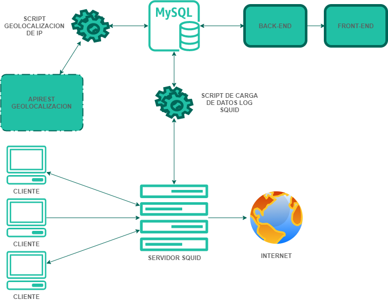

# Proyecto analitica de logs proxy

**INTRODUCCION DEL PROYECTO**

Crear un aplicativo que consiga información de conexiones usadas en un proxy, que realice un procesamiento a la información obtenida en el servidor proxy organizándola para ser mostrada en un dashboard.

1. Descubrir información en la instancia del servidor en la nube vultr
2. Analizar los datos obtenidos de las conexiones realizadas en el proxy.
3. Organizar la información recolectada en un servidor mysql
4. Desarrollar aplicativo para mostrar el laboratorio

El presente laboratorio consiste en crear un aplicativo, en primera instancia un servidor que consiga información de conexiones usadas en un proxy publicado en internet, en segunda instancia realizarle un procesamiento a la información capturada en el servidor proxy de manera que quede organizada y parametrizada en un servidor de base de datos de tipo mysql y por ultimo realizar un desarrollo el cual consuma la información organizada y la muestre en un dashboard. A continuación se mostrara una seria de significados utilizados en el laboratorio para mejorar la compresión del procedimiento realizado.

## Documentacion especifica Y pasos de instalación

- [Configuracion Squid](config_squid/README.md)
- [Base de Datos](database/README.md)
- [Script de Carga y Geolocalización](scripts/README.md)
- [Backend NodeJS](backend/README.md)
- [Front-End](frontend/README.md)

# Autores

- Maria Alejandra Calderón Duque
- Kevin David Quiroga Astroz

## Profesor guia

- Cristian Andres Rodriguez Montes

## Materia

- Linea de Profundizacion 3

## Universidad

- Universidad de Cundinamarca
