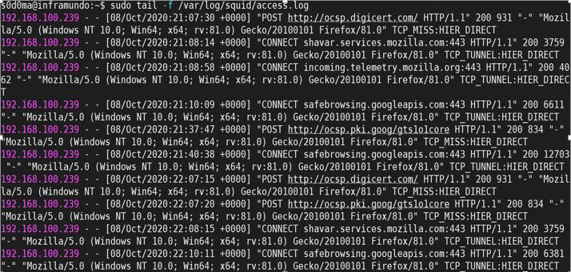

[Volver al indice](../README.md)

# Configuracion Squid

## Pasos de instalacion

```bash
sudo apt update
```

Este comando realiza la actualización de los repositorios del sistema operativo, permitiendo tener las últimas versiones de los paquetes a instalar en los pasos posteriores.

```bash
sudo apt install squid
```

Este comando realiza la instalación de la última versión del paquete debe (formato interno de sistema operativos Ubuntu y debían de squid con Sus respectivas dependencias y archivos de configuración.

```bash
sudo systemctl enable squid
```

Este comando habilita el servicio de squid para que cada vez que se reinicie el computador el servicio se ejecute en el inicio del systemd(demonio y servicio

```bash
sudo systemctl status squid
```

Este comando permite verificar que el servicio se está ejecutando en orden.

```bash
sudo systemctl stop squid
```

Este comando parara el servicio de squid para poder entrar a realizar cambios de configuración

```bash
sudo nano /etc/squid/squid.conf
```

Este comando abre en un editor de texto el archivo de configuración del servicio de squid y dentro de él se deben realizar los siguientes cambios.

```bash
http_port 8080 # Se define el puerto donde el servidor squid escuchara las conexiones entrantes y luego serán re direccionadas al host destino.

http_access deny all # se debe comentar esta línea que deniega todo el

logformat combined %>a %ui %un [%{%d/%b/%Y:%H:%M:%S +0000}tl] "%rm %ru HTTP/%rv" %Hs %<st "%{Referer}>h" "%{User-Agent}>h" %Ss:%Sh  #Este formato especifico de logs, nos permite capturar más datos de las peticiones realizadas en el servidor un ejemplo seria el tipo de petición y el tipo de user-agent generado.

access_log /var/log/squid/access.log combined #esta línea define que el formato de log anteriormente definido se combine con los logs del access_log en el archivo y ruta definida

```

```bash
sudo systemctl start squid && sudo systemctl status squid
```

este comando iniciaría el servicio de squid y verificara que el servicio de squid se esté corriendo bien.

```bash
sudo tail -f /var/log/squid/access.log
```

## Comprobación de Logs

este comando permitirá ver los logs en tiempo real, permitiendo ver los logs con el formato especifico, donde se podrá ver la ip de conexión, el código de respuesta, el tipo de petición y el user agent de donde se realizó la petición.


