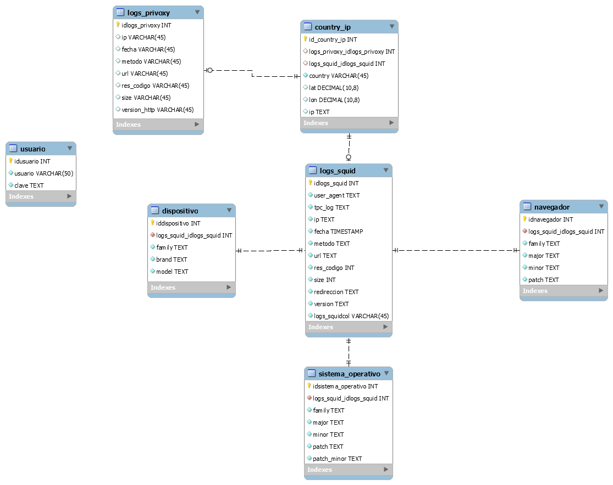

[Volver al indice](../README.md)

# Base de Datos



Se plantea este MER debido a los requerimientos dados para la creación de la plataforma, la cual almancenara los logs procesados del squid con los scripts anteriormente hablados.
Se Anexa el script de la creacion de la base de datos con los dos usuarios respectivos.

en el comentario de la siguiente sentencia se puede visualizar las credenciales MD5 y en texto claro

```sql
INSERT INTO db_proxy.usuario
  (usuario,
  clave)
VALUES
  ('admin_proxy',
  'e58aa7abb390a94dd05ab80eab2b3541'); -- e58aa7abb390a94dd05ab80eab2b3541:wxN0jK9pMHu1

INSERT INTO db_proxy.usuario
  (usuario,
  clave)
VALUES
  ('admin2_proxy',
  'e807f1fcf82d132f9bb018ca6738a19f'); -- e807f1fcf82d132f9bb018ca6738a19f:1234567890
```
