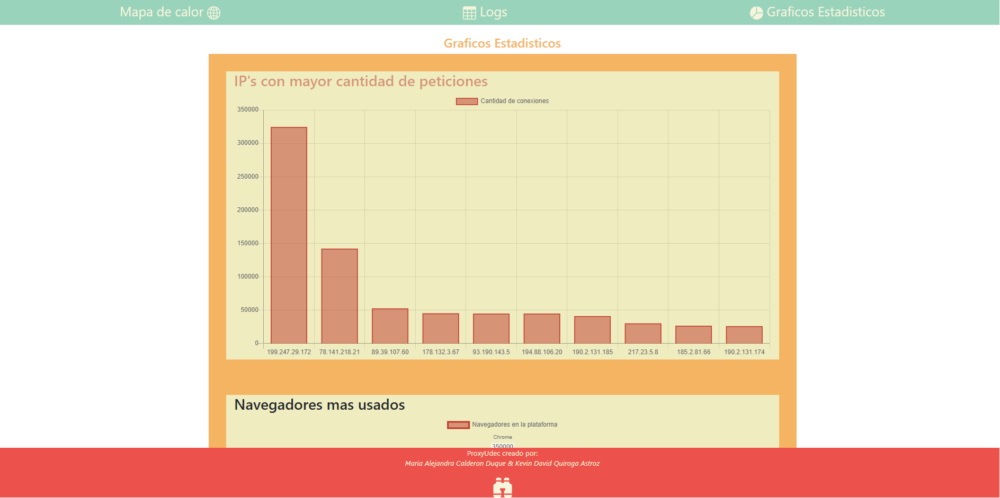

[Volver al indice](../README.md)

# Configuracion Front_End

## Instalación del Front-End

- Instalar apache y php en un servidor
- Mover la carpeta front-end htdocs
- Agregar API-KEY de google maps javaScript, que se encuentra en el archivo geo_Chart.js

```javascript
google.charts.load("current", {
  packages: ["geochart"],
  mapsApiKey: "PEGA AQUI TU API KEY",
});
```

## Login

Se importan las librerías, se conectan las hojas de estilos y se procede a la creación del formulario de registro, con sus debidos campos y en seguida se le aplican los estilos correspondientes.


## Mapa de Calor

Se importan las librerías, se conectan las hojas de estilos, se realiza la creación del menú, y se importa la imagen de mapa de calor en el html. Al realizar el archivo de Java Script se crea la función de google en donde nos permitirá dibujar las regiones de la más a la menos concurrida.


## Logs

Se realizó la creación de la barra superior menú y se pasa a desarrollar la maquetación de las tablas para ingresar los datos recogidos de los logs y se procede a aplicar los diferentes estilos de CSS.


## Graficos estadisticos

Se crea la maquetación en HTML de los containers donde irán ubicados cada uno de los gráficos, al aplicarle la interacción en Java Script se crea las debidas funciones para la creación de los gráficos donde se tendrá en cuenta su tipo, opciones y datos.


